# Songle

## Android location based app written in Kotlin.

Main objective is to guess songs from a list of preselected songs. To help your goal you can collecting words on the world map, mainly located around the University of Edinburgh central campus. Collecting a word reveals its location in the lyrics of the song.

Application uses Firebase Realtime Database and Authentication to guarantee enjoyable user experience and data persistance.

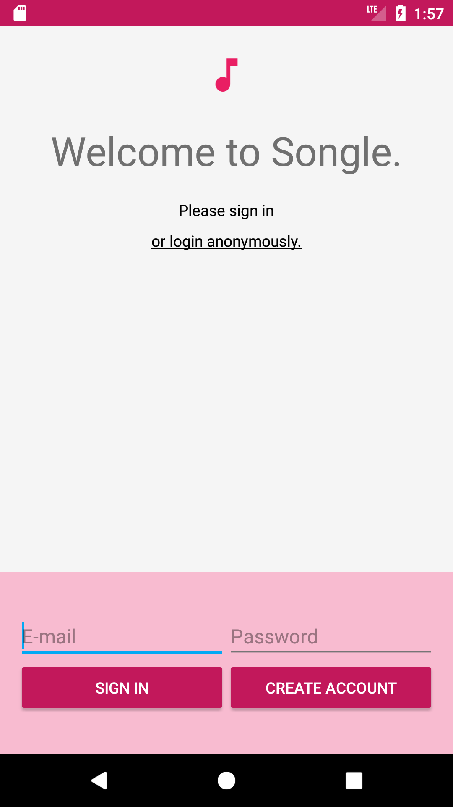

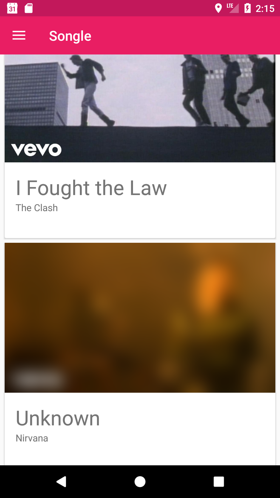

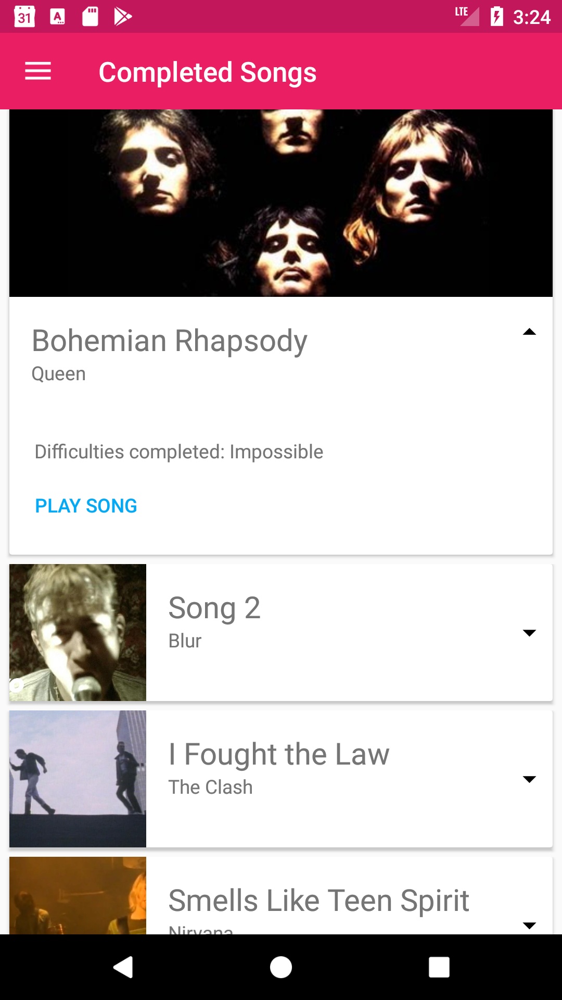

### Difficulties

The game has 5 difficulties, as seen below. With increase of difficulty the collect radius decreases and so does the total amount of available words on the map.

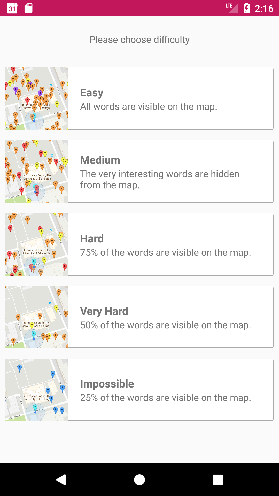

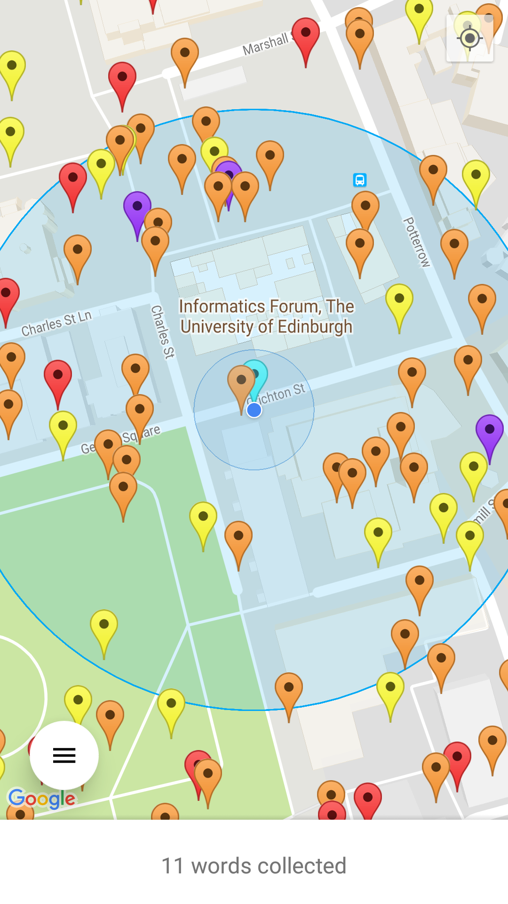

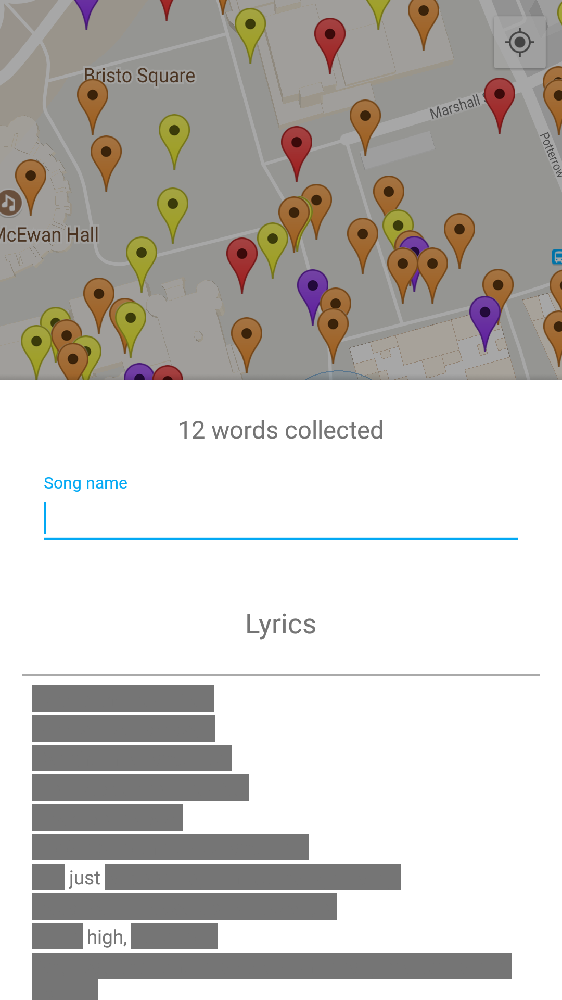

### Timer 

Last two difficulties include a timer. When the timer expires, all progress made is lost and the user has the option to either try the same song again or pick a different song. Word collection resets the timer.

When the user picks a difficulty, which has a timer, a brief explanation is showed of how the timer works.

Timer is being shown as a progress bar, near the bottom of the screen, on top of the words collected fragment.

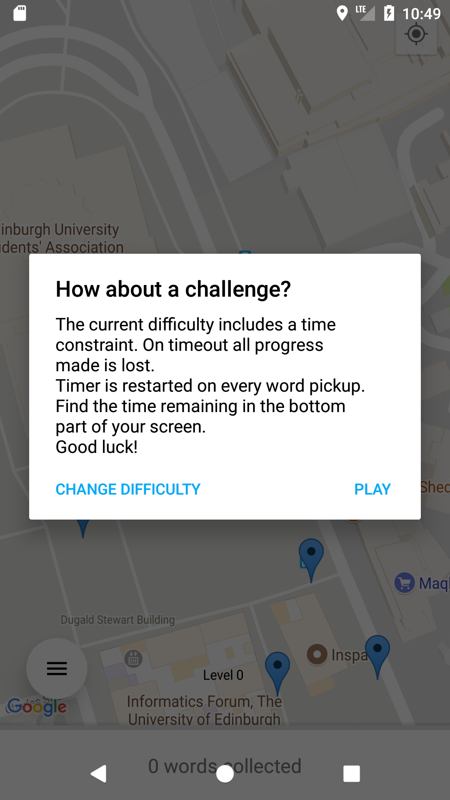

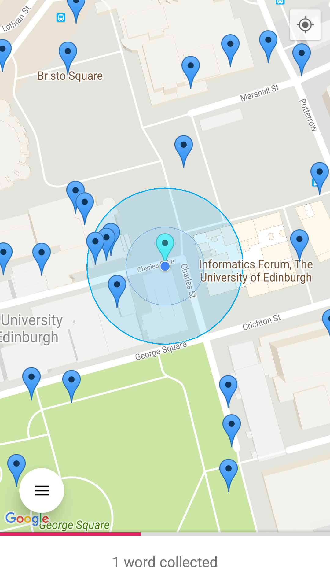

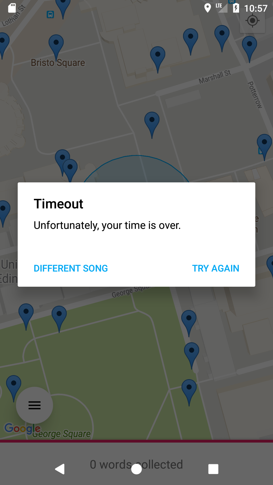

### Guessing the song

Guessing the song is done through expanding the fragment at the bottom of the screen. There you can get a visual feedback of the lyrics you have collected and guess the name of the song. Once song is guessed you can find it in your "Completed Songs" screen and play it on Youtube.

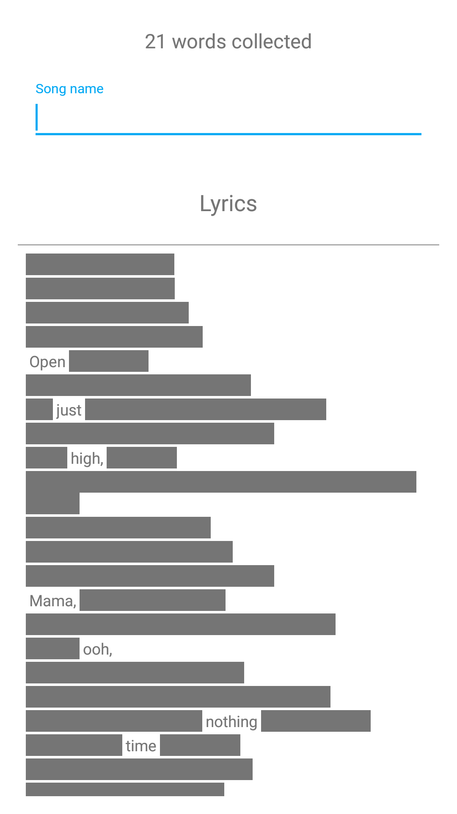

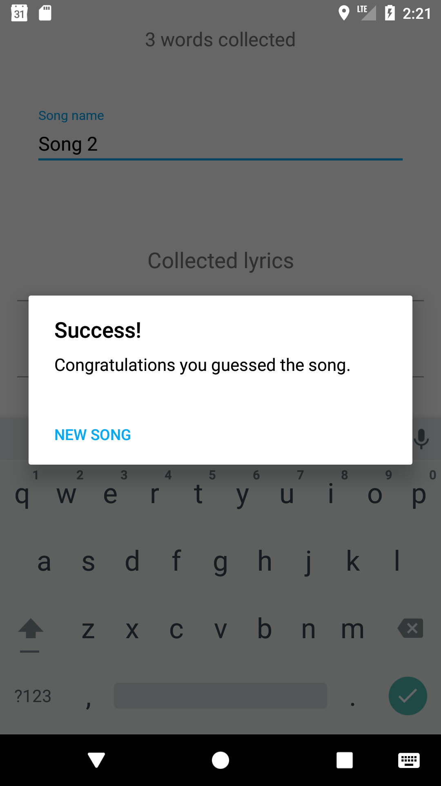

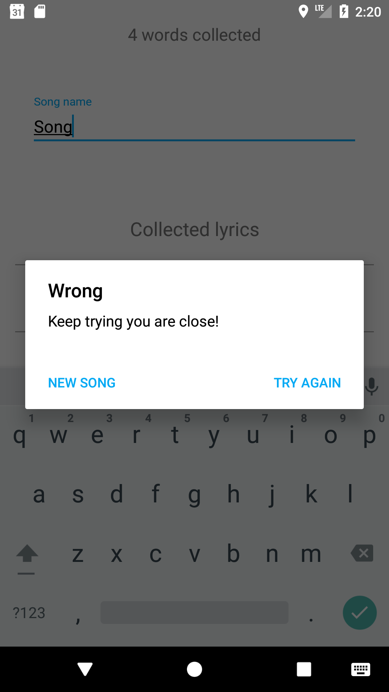

